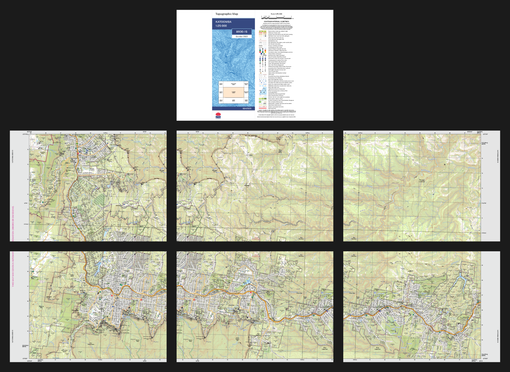

# nsw-topo-split

[](https://github.com/tschanzer/nsw-topo-split/actions/workflows/ci.yaml)
[](https://github.com/psf/black)
[](https://github.com/pylint-dev/pylint)
[](https://mypy-lang.org/)
[](https://github.com/pre-commit/pre-commit)

`nsw-topo-split` is a simple Python package that provides a command-line
interface for downloading and evenly splitting NSW Spatial Services topographic
maps across smaller pages. This is useful if you can't get an official hard copy
(e.g., for a new edition), or if you don't have access to a large-format printer
to print the digital maps provided on the [NSW Spatial Collaboration
Portal](https://portal.spatial.nsw.gov.au/portal/apps/webappviewer/index.html?id=06e3c2e0de1e4efda863854048c613c6).

## Quick example
```
nsw-topo-split cover katoomba 2022
nsw-topo-split map katoomba 2022
```


Maps shown above are © *State of New South Wales (Spatial Services, a business
unit of the Department of Customer Service NSW)*,  reproduced under the terms of
the Creative Commons Attribution 4.0 license.

## Installation
### Option 1: `pipx` (preferred)
This is the easiest option because it automatically installs `nsw-topo-split`
into a standalone virtual environment and allows you to run `nsw-topo-split`
anywhere.

[Install pipx](https://pipx.pypa.io/stable/installation/), then run
```bash
pipx install nsw-topo-split
```

### Option 2: `pip`
Create and activate a clean virtual environment, then run
```bash
pip install nsw-topo-split
```

### Development installation
Clone the repository and navigate to its root directory. Then, in a clean
virtual environment, run
```bash
pip install -r requirements-dev.txt  # for reproducibility
pre-commit install
pip install -e .
```

## Usage
```
usage: nsw-topo-split [-h] [-o OUT] [-f] [-d [DPI]] [-q] [-s SIZE] [-p]
                      [-n NX NY] [-l LX LY] [-w]
                      {map,cover} name year

split a NSW topographic map across smaller pages

positional arguments:
  {map,cover}           'map' to make the map pages, 'cover' to make the cover
                        pages
  name                  map name (case-insensitive), e.g., katoomba; remember
                        to quote names with spaces
  year                  year of publication

options:
  -h, --help            show this help message and exit
  -o OUT, --out OUT     output directory (default: working directory); files
                        are output in a subdirectory corresponding to the
                        publication year and map name, e.g.,
                        2022/8930-1S+KATOOMBA
  -f, --force-download  download the original map, even if it already exists
                        in the output directory
  -d [DPI], --dpi [DPI]
                        rasterize the output to the specified resolution
                        (default: 300 DPI); if this option is not given, then
                        the output will not be rasterized. WARNING: this may
                        make gridlines hard to see on some map editions. It
                        will also increase processing time, and file size for
                        mode=map.
  -q, --quiet           suppress log messages

page format options:
  -s SIZE, --size SIZE  page size (case-insensitive; default A3); options are
                        'A0' through 'A10', 'B0' through 'B10', 'C0' through
                        'C10', 'Card-4x6', 'Card-5x7', 'Commercial',
                        'Executive', 'Invoice', 'Ledger', 'Legal', 'Legal-13',
                        'Letter', 'Monarch' and 'Tabloid-Extra'
  -p, --portrait        use portrait layout rather than landscape
  -n NX NY, --n-pages NX NY
                        horizontal and vertical number of pages (determined
                        automatically by default)
  -l LX LY, --overlap LX LY
                        horizontal and vertical overlap between pages in mm
                        (default: [20.0, 20.0])
  -w, --allow-whitespace
                        do not expand overlaps to eliminate white space
```

For example, the [quick example](#quick-example) above will produce three PDFs
in `./2022/8930-1S+KATOOMBA`:
- `8930-1S+KATOOMBA.pdf`: The original map downloaded from Spatial Services
- `8930-1S+KATOOMBA_cover_a3.pdf`: A landscape A3 page with the map cover page
    and legend side-by-side
- `8930-1S+KATOOMBA_split_a3.pdf`: The map, split across six landscape A3 pages
  with 20mm overlaps.

When printing double-sided, make sure to choose "flip on long edge".
