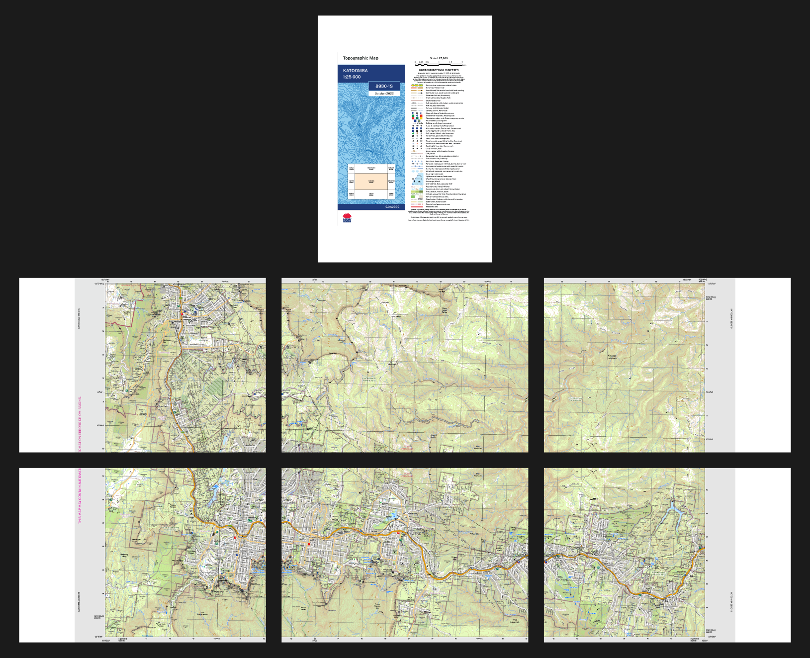

# nsw-topo-split

`nsw-topo-split` is a simple Python package that provides a command-line
interface for evenly splitting NSW Spatial Services topographic maps into A3
pages with 20mm overlaps. This is useful if you can't get an official hard copy
(e.g., for a new edition), or if you don't have access to a large-format printer
to print the GeoPDFs provided on the [NSW Spatial Collaboration
Portal](https://portal.spatial.nsw.gov.au/portal/apps/webappviewer/index.html?id=06e3c2e0de1e4efda863854048c613c6).

Before:


After:


Maps shown above are © *State of New South Wales (Spatial Services, a business
unit of the Department of Customer Service NSW)*,  reproduced under the terms of
the Creative Commons Attribution 4.0 license.

## Dependencies
- `pypdf`

## Installation
1. Clone the repository
2. Navigate to the repository directory and install using `pip install .`

## Usage
1. Download the map as a PDF from the
[NSW Spatial Collaboration Portal](https://portal.spatial.nsw.gov.au/portal/apps/webappviewer/index.html?id=06e3c2e0de1e4efda863854048c613c6)
(choose the "collar on" option).

2. Run `nsw_topo_split`:
```
usage: python -m nsw_topo_split [-h] [-o OUT] file

Split a NSW topographic map into A3 pages

positional arguments:
  file           Map file (PDF)

options:
  -h, --help     show this help message and exit
  -o, --out OUT  Output directory (default: file.parent)
```

If the input file was, say, `8930-1S+KATOOMBA.pdf`, then `nsw_topo_maps`
will produce two new PDFs:
- `8930-1S+KATOOMBA_cover.pdf`: A portrait A3 page with the map cover page
    and legend side-by-side
- `8930-1S+KATOOMBA_split.pdf`: The map, split across six landscape A3 pages
  with 20mm overlaps.

When printing double-sided, make sure to choose "flip on long edge".
